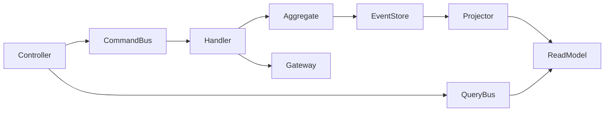

# FLC Backend — TDD / DDD / CQRS / Event Sourcing

Tài liệu tổng hợp chuyển đổi kiến trúc backend (đang migrate big-bang).

## Quyết định

| Hạng mục | Giá trị |
|----------|---------|
| Rollout | Big-bang skeleton + migrate theo bounded context |
| Style | CQRS + Domain Events + Event Sourcing |
| Write model | Postgres `event_store` (append-only) |
| Read model | Projection tables (Eloquent) |
| Buses | Custom `Flc\Shared\Application\CommandBus` / `QueryBus` |
| Namespace | `Flc\` → [`backend/src/Flc/`](../backend/src/Flc/) |
| TDD | Outside-in: Feature → Unit aggregate/handler → implement |

## Before → After

### Trước

```
app/
  Http/Controllers/{Api,Web,Admin}/
  Services/          # transaction scripts
  Models/            # Eloquent = domain
  Jobs/
```

### Sau (đích)

```
src/Flc/
  Shared/            # AggregateRoot, EventStore, buses, SyncEventPublisher
  Dictionary/        # Domain + Application + Infrastructure
  Vocabulary/        # (pending)
  Media/ Listening/ Quiz/ Identity/ Notification/ AdminSettings/
app/Http/...         # Thin adapters → CommandBus / QueryBus
app/Services/...     # Compatibility facades (đang gỡ dần)
```



## Đã migrate

### Shared kernel

| Thành phần | Path |
|------------|------|
| `AggregateRoot`, `DomainEvent` | `src/Flc/Shared/Domain/` |
| `EventStore`, `AggregateRepository`, buses | `src/Flc/Shared/Application/` |
| `EloquentEventStore`, `SyncEventPublisher` | `src/Flc/Shared/Infrastructure/` |
| Migration | `database/migrations/2026_07_13_100000_create_event_store_table.php` |
| Provider | [`app/Providers/FlcServiceProvider.php`](../backend/app/Providers/FlcServiceProvider.php) |

### Dictionary (My Dictionary) — hoàn chỉnh ES + CQRS

| Cũ | Mới |
|----|-----|
| `DictionaryService::lookup` | Query `Flc\Dictionary\Application\Query\LookupWord` |
| `DictionaryService::upsertOnSave` | Command `UpsertDictionaryOnSave` |
| `DictionaryService::replaceCuratedContent` | Command `CurateDictionaryEntry` |
| Admin delete | Command `DeleteDictionaryEntry` |
| Free Dictionary HTTP | Port `FreeDictionaryGateway` / `HttpFreeDictionaryGateway` |
| DB tables | Projection qua `DictionaryEntryProjector` |

**Events**

| Event type | Ý nghĩa |
|------------|---------|
| `dictionary.entry_created` | Tạo entry |
| `dictionary.content_replaced` | Thay toàn bộ meanings/syn/ant (admin curate hoặc init) |
| `dictionary.content_merged` | Merge nghĩa khi Lưu từ (chưa curated) |
| `dictionary.save_counted` | Tăng save_count (curated) |
| `dictionary.entry_deleted` | Xóa |

**Policy giữ nguyên:** Lookup miss **không** ghi DB; chỉ **Lưu từ** / admin mới ghi event + projection.

`App\Services\DictionaryService` còn là **facade** gọi buses (để Api/Web/Admin không đổi hết một lúc).

## Cut-over

```bash
./vendor/bin/sail artisan migrate
./vendor/bin/sail artisan flc:seed-dictionary-events
./vendor/bin/sail artisan test
```

`flc:seed-dictionary-events` tạo stream từ projection hiện có (rows My Dictionary trước ES).

## TDD conventions

- Feature: `tests/Feature/` — HTTP/API behavior
- Unit ES: `tests/Unit/Flc/` — append / replay / project
- Dictionary: `tests/Feature/DictionaryServiceTest.php`

Thêm feature: viết test → Command/Query + Handler → Aggregate events → Projector → thin controller.

## Còn lại (roadmap trong cùng big-bang)

| Context | Việc chính |
|---------|------------|
| Vocabulary | Aggregate `UserVocabulary` + Save/Delete commands; bỏ logic trong controllers |
| Identity | Commands quanh Google login + allowlist query |
| Quiz / Notification | Commands reminder + quiz attempt events |
| Media / Listening | ProcessMedia / SubmitAttempt commands; Jobs → CommandBus |
| AdminSettings | Curate settings commands |
| Cleanup | Xóa facade `app/Services/*` khi mọi caller dùng buses |

## Không đổi

- Public API JSON contract (extension/mobile)
- Sanctum / Socialite token flow
- Blade admin UX (chỉ đổi chỗ gọi service → command)

## Cách thêm Command mới (checklist)

1. Feature/Unit test (red)
2. `Domain/Event/*` + apply trên Aggregate
3. `Application/Command|Query` + `Handler`
4. Đăng ký event type map + handler map trong `FlcServiceProvider`
5. Projector cập nhật read model
6. Controller `dispatch` / `ask`
7. Xóa logic cũ trong Service nếu còn
