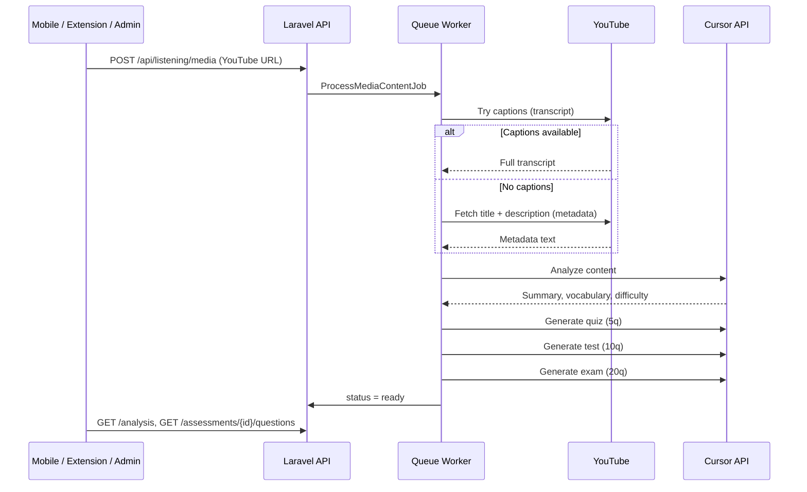

# YouTube URL → Content → Quiz / Test / Exam

This document explains how the FLC backend processes a **YouTube URL**, extracts **content** (with or without captions), and creates **listening assessments** (quiz, test, exam).

---

## Overview



| Step | What happens |
|------|----------------|
| 1. Save URL | Store video URL, extract `source_id` (video ID) |
| 2. Resolve content | Transcript → metadata → notes → title (fallback chain) |
| 3. Analyze | Cursor AI (or local fallback) builds summary & vocabulary |
| 4. Generate assessments | Auto-create **quiz**, **test**, and **exam** |
| 5. Take exam | Mobile app loads questions, user submits answers |

---

## Prerequisites

### Environment (`.env`)

```env
CURSOR_API_KEY=your_key_from_cursor_dashboard
CURSOR_MODEL=composer-2.5
CURSOR_TIMEOUT_SECONDS=180
QUEUE_CONNECTION=database
```

Get a Cursor API key: **Cursor Dashboard → API Keys**.

### Queue worker (required)

Analysis runs in the background. Without the queue worker, jobs stay pending.

```bash
cd backend
php artisan migrate
php artisan queue:work
```

---

## Step 1 — Save a YouTube URL

### API (recommended for mobile app)

```http
POST /api/listening/media
Authorization: Bearer {sanctum_token}
Content-Type: application/json

{
  "title": "English Listening Lesson",
  "type": "youtube",
  "url": "https://www.youtube.com/watch?v=VIDEO_ID",
  "language": "en",
  "frequency": "weekly",
  "auto_process": true
}
```

| Field | Required | Description |
|-------|----------|-------------|
| `title` | yes | Display name for the lesson |
| `type` | yes | Must be `youtube` |
| `url` | yes | Valid YouTube watch / shorts / youtu.be URL |
| `language` | no | Default `en` — used when fetching captions |
| `auto_process` | no | Default `true` — starts analysis immediately |

**Response (201):**

```json
{
  "data": {
    "id": 1,
    "title": "English Listening Lesson",
    "url": "https://www.youtube.com/watch?v=VIDEO_ID",
    "source_id": "VIDEO_ID",
    "type": "youtube",
    "analysis_status": "pending"
  },
  "message": "Media saved. Analysis and listening assessments are being generated."
}
```

### Chrome extension

On a YouTube video tab → open extension → **Media** tab → fields auto-fill → **Thêm link**.

Uses the same `POST /api/listening/media` endpoint.

### Admin panel

**Admin → Video / MP3 → + Thêm video / MP3** — select user, paste URL, enable auto-process.

---

## Step 2 — How content is extracted from YouTube

Job: `App\Jobs\ProcessMediaContentJob`  
Resolver: `App\Services\MediaContentResolverService`

The system tries sources **in this order**:

| Priority | Source | `content_source` value | Description |
|----------|--------|------------------------|-------------|
| 1 | Manual transcript | `transcript` | If `transcript` was sent when saving |
| 2 | YouTube captions | `transcript` | Auto-generated or uploaded subtitles |
| 3 | YouTube metadata | `metadata` | Title, channel, description from watch page |
| 4 | User notes | `notes` | Notes field on media item |
| 5 | Title + URL only | `title_only` | Last resort |

### 2a. Transcript (captions)

Service: `YouTubeTranscriptService`

1. Fetch `https://www.youtube.com/watch?v={videoId}`
2. Parse `captionTracks` from page HTML
3. Download caption XML for requested language (fallback: any language)
4. Join caption lines into plain text

**Best quality** for listening questions — questions can reference exact spoken content.

### 2b. Metadata (no captions)

Service: `YouTubeMetadataService`

If captions are missing or blocked:

1. Fetch the same watch page
2. Read `og:title`, `og:description`, `shortDescription`, etc.
3. Build text like:

```
Title: How to improve English listening

Channel: English with Lucy

Description: In this video we discuss ...

URL: https://www.youtube.com/watch?v=VIDEO_ID
```

**Cursor AI** then infers topics and generates reasonable questions from title/description. Questions are **less precise** than transcript-based ones but still usable for practice.

---

## Step 3 — Content analysis

Service: `ContentAnalysisService` (uses `CursorAgentService`)

Input: resolved content text + title + language + `content_source`

Output stored in `media_items.analysis_payload`:

```json
{
  "summary": "...",
  "topics": ["..."],
  "key_vocabulary": [{ "word": "...", "definition": "..." }],
  "difficulty": "intermediate",
  "main_ideas": ["..."],
  "content_source": "metadata",
  "source_content": "Title: ...\n\nDescription: ...",
  "source": "cursor"
}
```

If `CURSOR_API_KEY` is missing, a **local fallback** generates basic analysis from word frequency.

---

## Step 4 — Create quiz, test, and exam

Service: `ListeningAssessmentGeneratorService`

After analysis succeeds, the job automatically creates **three** assessments per media item:

| Type | Questions | Time limit | Pass threshold |
|------|-----------|------------|----------------|
| `quiz` | 5 | 10 min | 60% |
| `test` | 10 | 20 min | 70% |
| `exam` | 20 | 45 min | 75% |

Each assessment is stored in:

- `listening_assessments` — header (type, title, status)
- `listening_questions` — MCQ, true/false, fill-blank, comprehension

Question types: `mcq`, `fill_blank`, `true_false`, `comprehension`

Config: `backend/config/listening.php` → `assessments`

---

## Step 5 — Poll status & fetch the exam

### Check analysis status

```http
GET /api/listening/media/{id}/analysis
Authorization: Bearer {token}
```

| `analysis_status` | Meaning |
|-------------------|---------|
| `pending` | Waiting for queue |
| `processing` | Job running |
| `ready` | Done — assessments available |
| `failed` | See `analysis_error` |

### List assessments

```http
GET /api/listening/media/{id}/assessments
```

### Get exam questions (no correct answers)

```http
GET /api/listening/assessments/{assessment_id}/questions
```

Find the assessment where `"type": "exam"`.

### Submit exam attempt

```http
POST /api/listening/assessments/{assessment_id}/attempts
Content-Type: application/json

{
  "answers": [
    { "question_id": 1, "answer": "Option A" },
    { "question_id": 2, "answer": "True" }
  ]
}
```

Response includes score, percentage, pass/fail, and per-question feedback.

---

## Re-run or regenerate

### Retry failed analysis

```http
POST /api/listening/media/{id}/process
```

### Regenerate only the exam

```http
POST /api/listening/media/{id}/assessments/generate
Content-Type: application/json

{ "type": "exam" }
```

Omit `type` to regenerate quiz + test + exam.

---

## Database tables

| Table | Role |
|-------|------|
| `media_items` | YouTube URL, `source_id`, `analysis_status`, `transcript`, `analysis_payload` |
| `listening_assessments` | quiz / test / exam records |
| `listening_questions` | Questions per assessment |
| `listening_attempts` | User scores and answers |

---

## Key backend files

| File | Purpose |
|------|---------|
| `app/Http/Controllers/Api/ListeningMediaController.php` | Save media, trigger process |
| `app/Jobs/ProcessMediaContentJob.php` | Orchestrates full pipeline |
| `app/Services/MediaContentResolverService.php` | Transcript / metadata fallback |
| `app/Services/YouTubeTranscriptService.php` | Fetch captions |
| `app/Services/YouTubeMetadataService.php` | Fetch title & description |
| `app/Services/ContentAnalysisService.php` | AI analysis |
| `app/Services/ListeningAssessmentGeneratorService.php` | Generate questions |
| `app/Services/CursorAgentService.php` | Cursor Cloud Agents API client |
| `routes/api.php` | All `/api/listening/*` routes |

---

## Troubleshooting

| Problem | Solution |
|---------|----------|
| Stuck on `pending` | Run `php artisan queue:work` |
| `analysis_status: failed` | Check `analysis_error`; retry with `POST .../process` |
| No captions error (old) | Should not happen now — metadata fallback is automatic |
| Poor exam quality | Video has no captions → only title/description used; prefer videos with subtitles |
| Cursor timeout | Increase `CURSOR_TIMEOUT_SECONDS` in `.env` |
| Slow processing | Normal — up to 4 Cursor API calls per video (1 analysis + 3 assessments) |

---

## Minimal mobile app flow

```
1. POST /api/listening/media          → save YouTube URL
2. Poll GET /api/listening/media/{id}/analysis until status = ready
3. GET /api/listening/media/{id}/assessments → find type = exam
4. GET /api/listening/assessments/{exam_id}/questions
5. User watches/listens to YouTube video (WebView / external app)
6. POST /api/listening/assessments/{exam_id}/attempts → submit answers
```

---

## Related docs

- [PLAN.md](./PLAN.md) — overall architecture
- [ADMIN.md](./ADMIN.md) — admin UI for media & assessments
- [GOOGLE_AUTH.md](./GOOGLE_AUTH.md) — extension / API authentication
